# PHP项目实战：广科大校内实习网站1

作者：Hingsmy

## 项目过程

### **0. 获得静态网页模版**

[gkd-internship-website-theme.zip](php-project-internship-website-1/gkd-internship-website-theme.zip)

### **1. 创建并测试PHP文件**

1. **安装并启动XAMPP**：确保你已经在你的计算机上安装了XAMPP，并且启动了Apache服务器。XAMPP控制面板中的“Start”按钮可以用来启动Apache。
2. **定位到htdocs目录**：在XAMPP中，所有的Web项目都应该放在  **`htdocs`**  目录下。这是Apache服务器查找文件的默认位置。根据你的操作系统，这个目录位于XAMPP安装目录下的  **`htdocs`**  文件夹中。
3. **创建项目目录**：在  **`htdocs`**  目录中，创建一个名为  **`php-tutorial`**  的新文件夹，然后在该文件夹内再创建一个名为  **`gkd-internship-website`**  的子文件夹。这个子文件夹将作为我们《广科大校内实习网站》项目的根目录。
4. **创建PHP文件**：在  **`gkd-internship-website`**  目录下创建一个名为  **`index.php`**  的文件。这个文件将作为我们网站的入口点，可以包含文本、HTML标记、CSS样式以及PHP代码本身。
5. **撰写基本PHP代码**：在  **`index.php`**  文件中，编写简单的PHP代码  **`<?php echo 'Hello World!'; ?>`**  。这段代码的作用是在访问网站时，在网页上打印出"Hello World!"消息。
    
    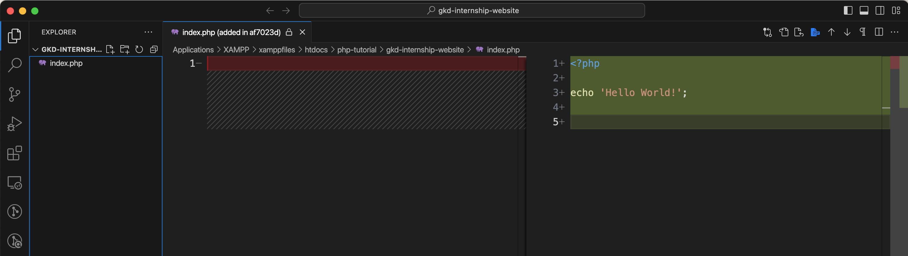
    
6. **测试PHP文件**：打开Web浏览器，输入  **`http://localhost/php-tutorial/gkd-internship-website/index.php`**  。如果一切设置正确，你应该能看到页面上显示的"Hello World!"消息。
    
    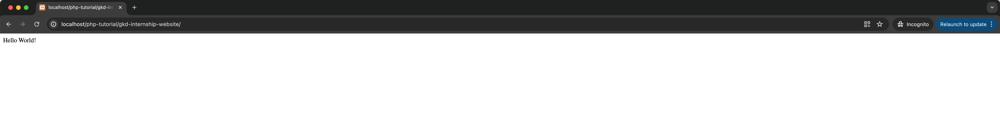
    
7. **初始化Git仓库**：在  **`gkd-internship-website`**  项目目录中打开命令行或终端，执行  **`git init`**  命令来初始化一个新的Git仓库。这一步是使用Git跟踪项目文件变化的前提。
8. **跟踪和提交更改**：首先使用 **`git add .`** 命令添加所有文件到暂存区，然后用 **`git commit -m "初始化项目并添加Hello World示例"`** 命令提交这些更改到仓库。
9. **定期提交**：建议在每完成一个功能点或者修复一个bug后进行提交，以便更好地管理和跟踪项目的进展。

### **2. 引入主页视图**

1. **修改`index.php`文件**：在 **`index.php`** 中，我们移除了原来的 **`echo 'Hello World!';`** 代码，替换为 **`require './views/home.view.php';`** 。这个更改的目的是让PHP加载一个外部文件，即我们的主页视图。
    
    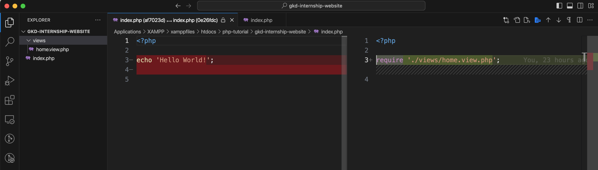
    
2. **创建视图文件**：在项目目录下创建一个新的文件夹 **`views`** ，然后在 **`views`** 文件夹中创建 **`home.view.php`** 文件。这个文件包含了我们网站主页的HTML结构，主页的内容可以在静态网页模版压缩包中获得。
    
    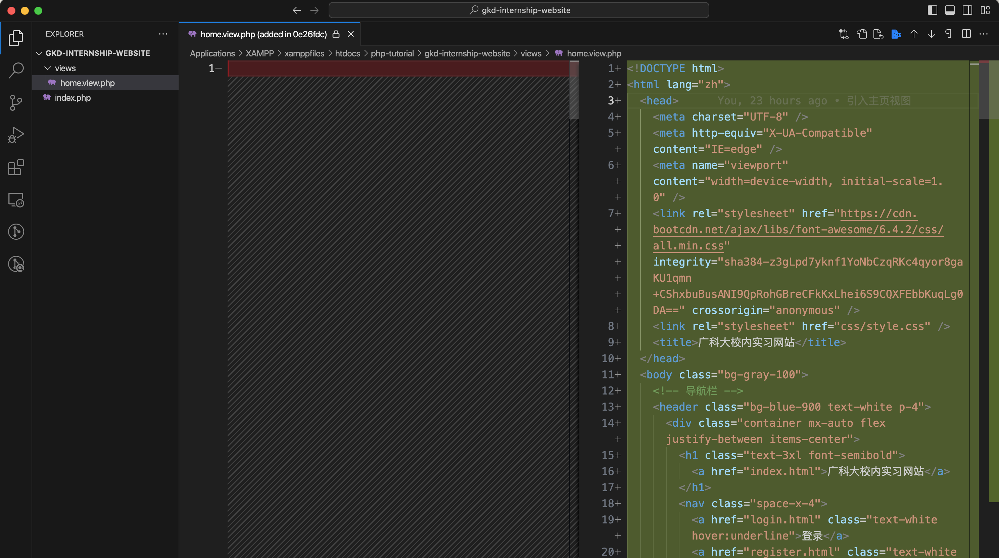
    
    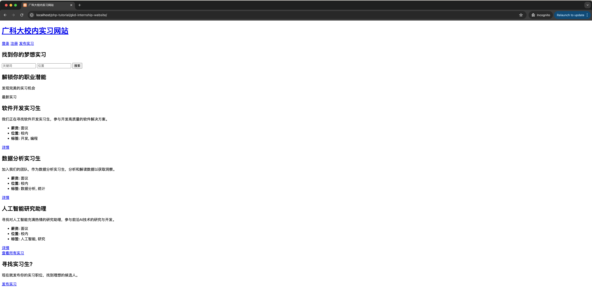
    

### **3. 创建public文件夹并调整项目结构**

1. **创建`public`文件夹**：在项目根目录下创建一个新的文件夹命名为 **`public`** 。这个文件夹将作为网站的根目录，用于存放所有公开访问的资源，如HTML、CSS、JavaScript文件。
2. **移动`index.php`文件到`public`文件夹**：将原先位于项目根目录的 **`index.php`** 文件移动到 **`public`** 文件夹中。这样做的目的是确保只有 **`public`** 目录下的文件对外界可见，提高应用的安全性。
3. **更新`index.php`中的路径**：由于 **`index.php`** 文件现在位于 **`public`** 文件夹内，我们需要更新它里面的路径来正确地引用 **`views/home.view.php`** 文件。因此， **`require`** 语句的路径从 **`./views/home.view.php`** 更改为 **`../views/home.view.php`** ，这表示访问上一级目录（即项目根目录）下的 **`views`** 文件夹。
    
    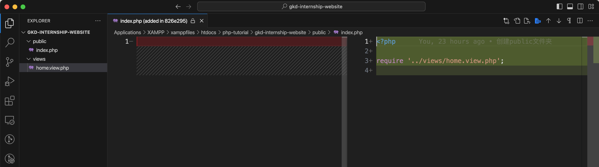
    
4. 在 **`public`** 文件夹中创建 **`css`** 文件夹和 **`images`** 文件夹，并从网页模版中找到 **`style.css`** 和 **`showcase.jpg`** 放在合适的位置。
    
    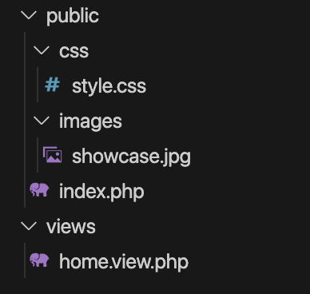
    
5. 此时网页应能载入样式表，效果如下：
    
    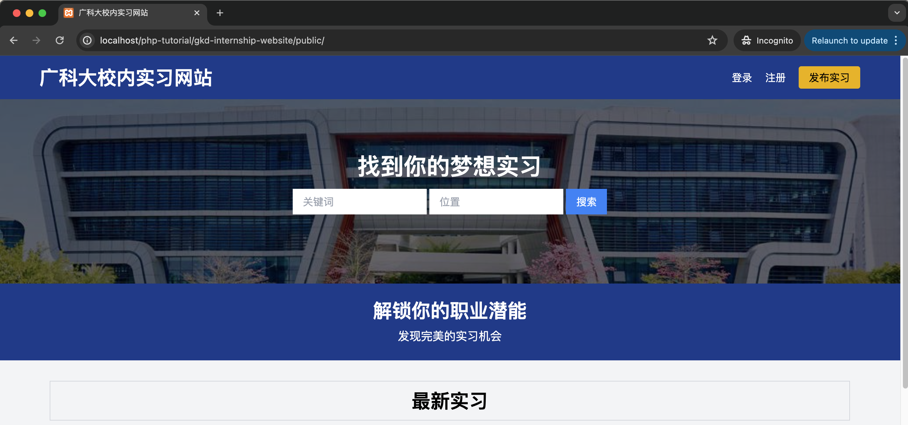
    

### **4. 设置文件根路径的helper方法**

1. **创建`helpers.php`文件**：在项目的根目录下创建一个新文件 **`helpers.php`** ，这个文件将用于存放项目中用到的辅助函数。
2. **定义`basePath`函数**：在 **`helpers.php`** 中定义了一个名为 **`basePath`** 的函数。这个函数接受一个可选的参数 **`$path`** ，其目的是为了生成一个绝对路径。函数内部使用了PHP的魔术常量 **`__DIR__`** ，它返回当前文件所在的目录。然后，将这个目录和传入的相对路径 **`$path`** 拼接起来，形成一个完整的文件路径。
3. **修改`public/index.php`中的路径引用**：在 **`public/index.php`** 文件中，首先引入了 **`helpers.php`** 文件，以便可以使用 **`basePath`** 函数。随后，通过调用 **`basePath`** 函数来引入 **`views/home.view.php`** ，而不是之前直接使用相对路径。

<aside>
💡 通过使用 **`basePath`** 这样的辅助函数，我们可以使路径引用在整个项目中更加统一和清晰。

</aside>

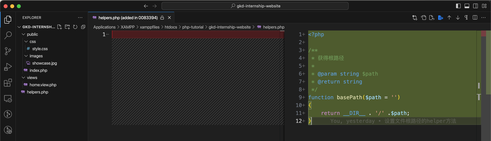

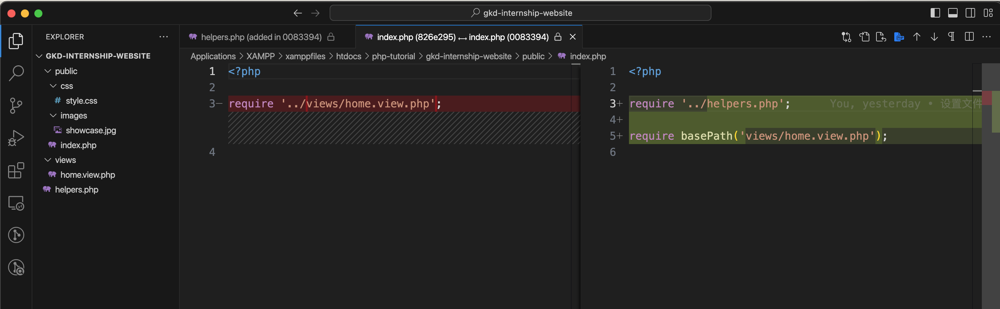

### **5. 创建`partials`文件夹并添加头部和底部文件**

1. **创建`partials`文件夹**：在 **`views`** 文件夹下创建一个新的子文件夹命名为 **`partials`** 。这个文件夹将用于存放网站的公共视图部分，例如头部（head）和底部（footer）等，这样有助于保持视图文件的组织和管理。
2. **创建`head.php`和`footer.php`文件**：
    -  **`head.php`** ：此文件包含了网页的头部信息，通常包括 **`<head>`** 标签内的内容，如字符集声明、视口设置、引入外部CSS文件和网站标题等。
    -  **`footer.php`** ：此文件包含了网页的底部部分，通常是闭合的 **`<body>`** 和 **`<html>`** 标签之前的内容，可能包括版权声明、引入JavaScript文件等。
    
    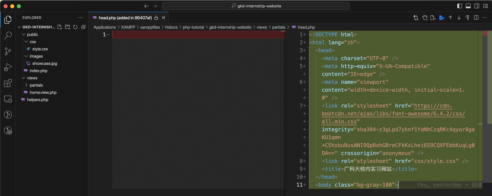
    
    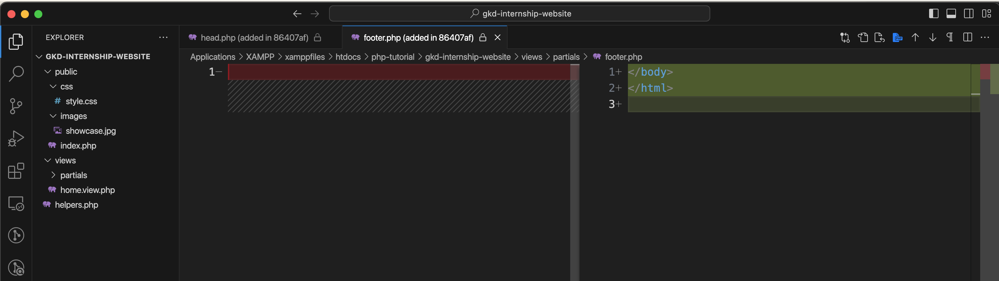
    
3. **调整`home.view.php`文件**：在 **`home.view.php`** 中，移除原有的头部和底部代码，并通过 **`require`** 函数引入 **`head.php`** 和 **`footer.php`** 。这意味着在 **`home.view.php`** 的开始处引入 **`head.php`** ，并在文件末尾前引入 **`footer.php`** 。在 **`home.view.php`** 文件中引入 **`head.php`** 和 **`footer.php`** ：
    
    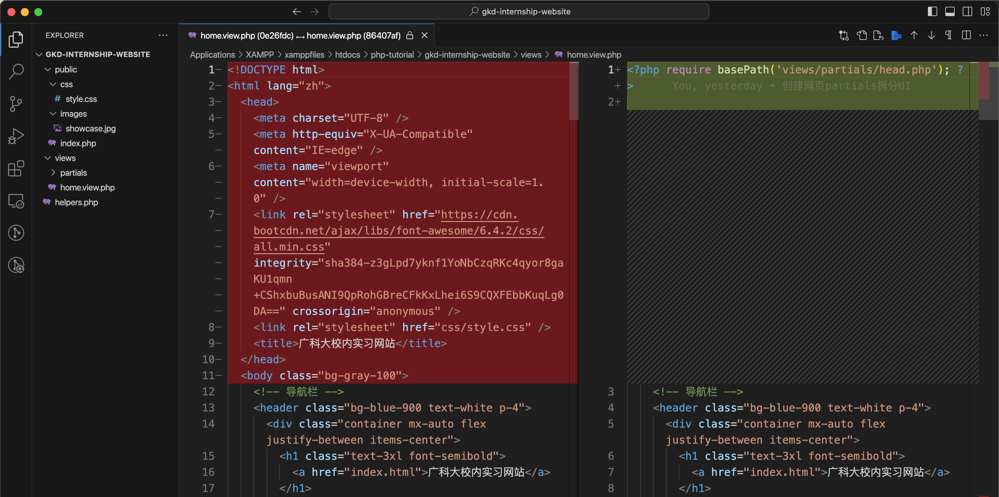
    

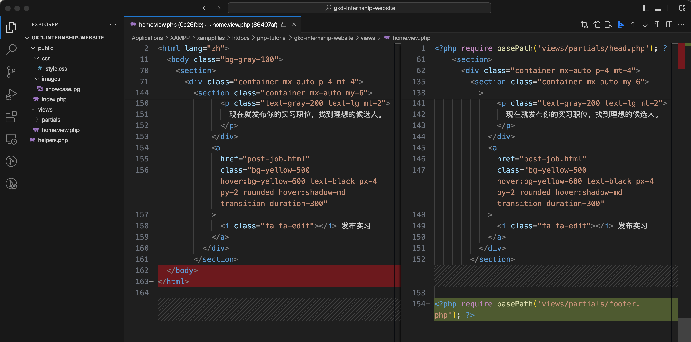

1. 调整完毕后，应及时查看网页效果，此时效果应保持不变。

### **6. 继续拆分UI**

1. **创建组件文件**：
    -  **`navbar.php`** ：包含网站导航栏的HTML结构和必要的链接。这部分通常位于网页的最顶部，提供导航功能。
        
        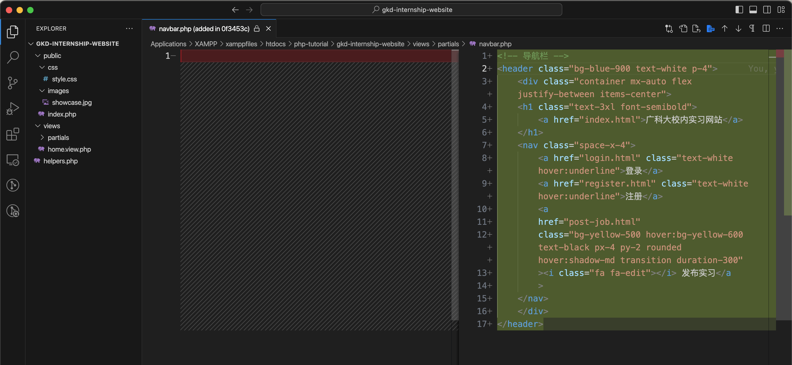
        
    -  **`showcase-search.php`** ：包含主要的展示区和搜索表单。这部分用于吸引用户注意力，并提供一个搜索实习机会的快捷方式。
        
        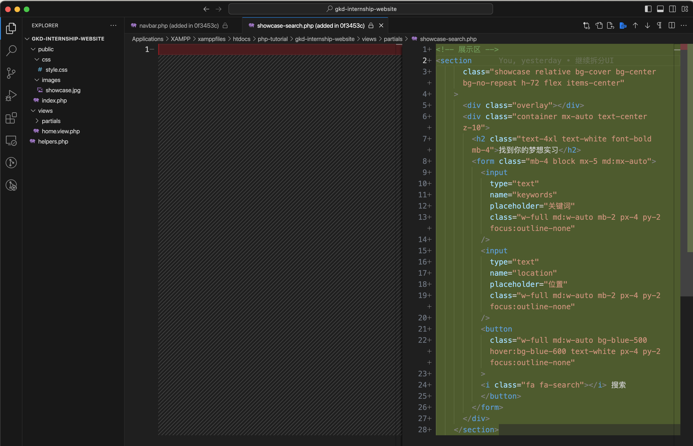
        
    -  **`bottom-banner.php`** ：包含位于网页底部的横幅，可能用于展示广告、合作伙伴信息或其他营销内容。
        
        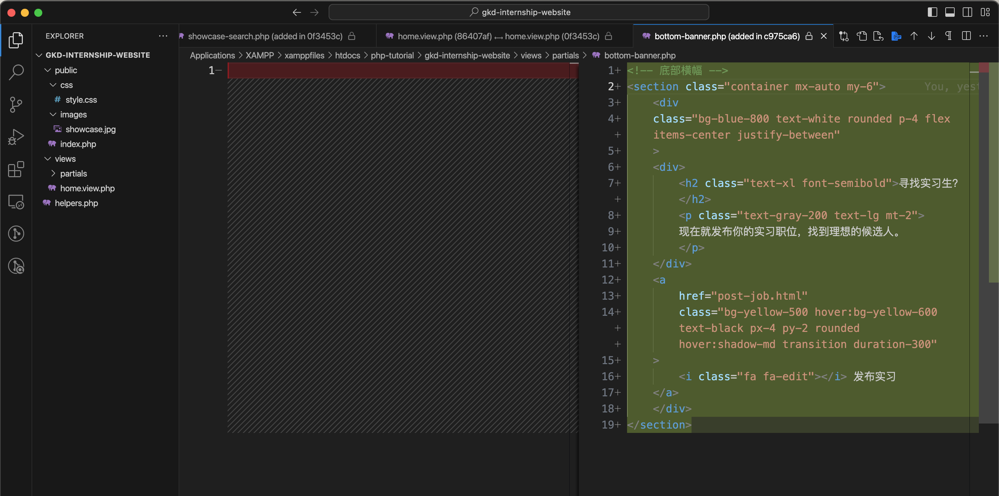
        
    -  **`top-banner.php`** ：包含顶部横幅的内容，通常用于显示重要的通知或促销信息。
        
        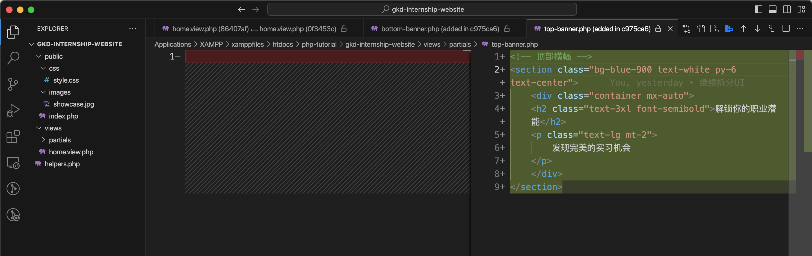
        
2. **在`home.view.php`中引入组件**：
在 **`home.view.php`** 文件的相应位置，引入这些拆分出的文件。
    
    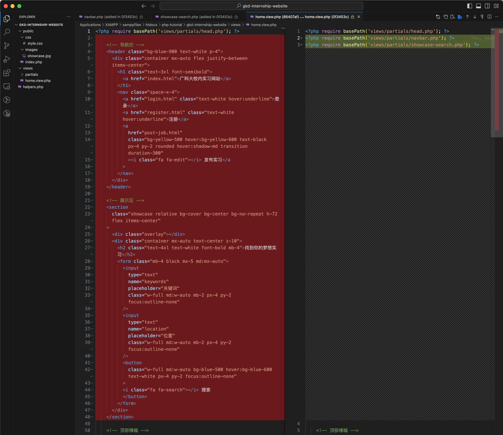
    
    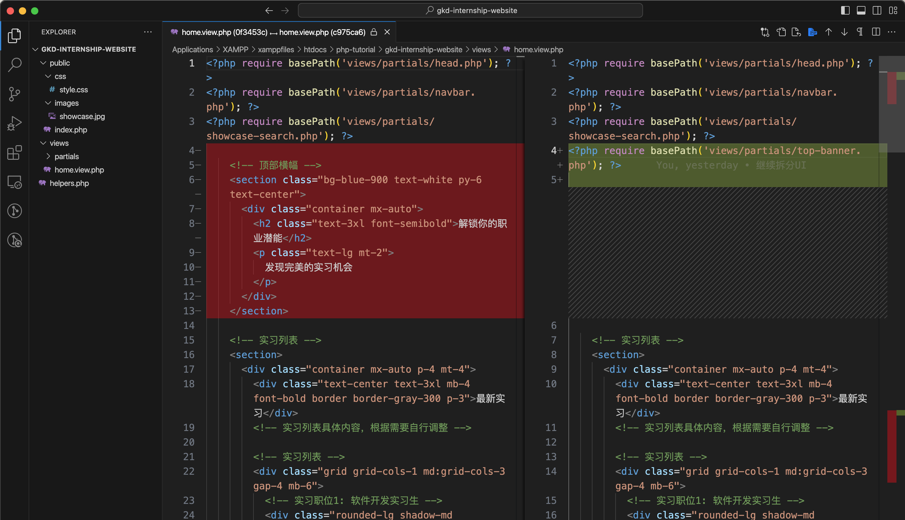
    

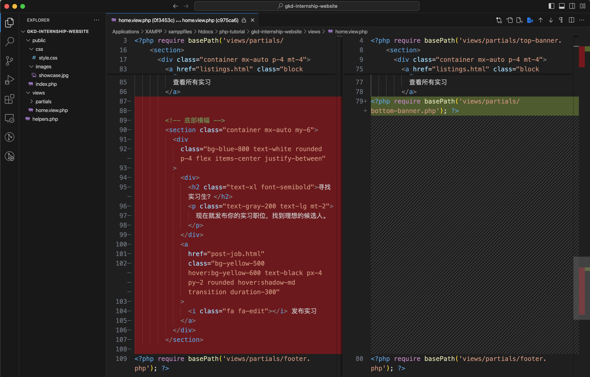

### **7. 引入新的工具函数`loadPartial`** 

1. 在 **`helpers.php`** 中，紧接着 **`basePath`** 函数后面，新增 **`loadPartial`** 函数。这个函数的目的是封装 **`require`** 调用，使得加载视图文件变得更简单。
    - **参数**： **`$name`** ，代表要加载的部分视图（partial）的名称。
    - **功能**：通过拼接 **`basePath`** 函数返回的路径和传入的视图文件名来构建完整的文件路径，然后使用 **`require`** 语句加载指定的视图文件。
    
    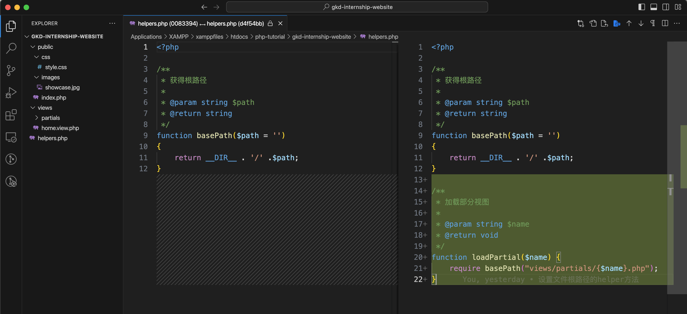
    
2. 在 **`home.view.php`** 文件中，原先直接使用 **`require`** 加上 **`basePath`** 函数来加载视图部分的代码，现在被替换为通过 **`loadPartial`** 函数来实现。例如，原来的 **`<?php require basePath('views/partials/head.php'); ?>`** 现在简化为 **`<?php loadPartial('head'); ?>`** 。
    
    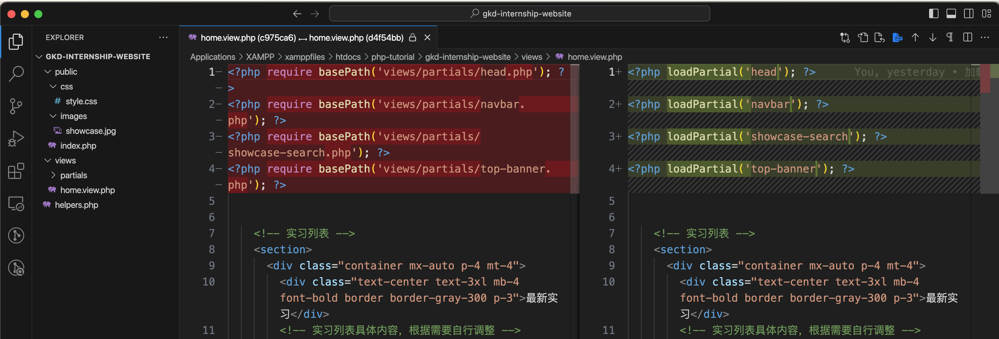
    
    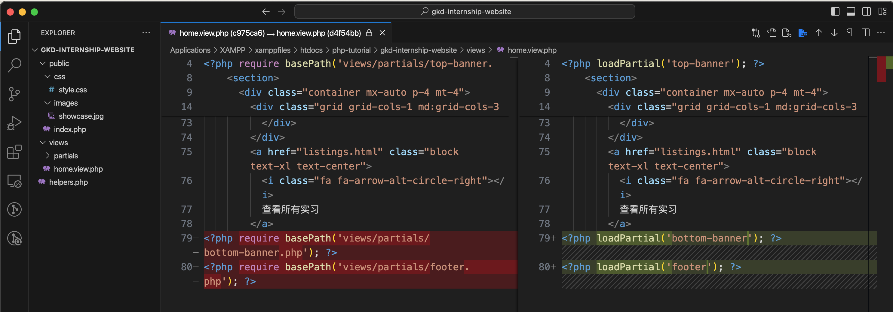
    
    <aside>
    💡 **为什么采取这样的做法？**
    
    - **简化代码**：通过 **`loadPartial`** 函数，减少了每次引入视图文件时需要书写的代码量，使得代码更加简洁。
    - **提高可维护性**：将加载视图部分的逻辑封装在 **`loadPartial`** 函数中，如果将来加载机制有所变化，只需修改这个函数的实现即可，而不用逐个更新每个视图文件中的代码。
    </aside>
    
3. 完成这部分代码后，应及时测试，此时网页应还能正常显示。

### **8. 创建`loadView`函数**

1. **功能增强**： **`loadView`** 函数的设计目的是为了加载指定的视图文件，类似于 **`loadPartial`** ，但它用于加载位于 **`views`** 目录下的视图文件，而非 **`partials`** 子目录下的文件。
2. **参数**： **`$name`** ，这是视图文件的名称，不包括 **`.view.php`** 后缀。
3. **实现逻辑**：
    - 首先，通过拼接给定的视图名称和路径，构建视图文件的完整路径。
    - 然后，使用 **`file_exists`** 函数检查该路径下的视图文件是否存在。
    - 如果文件存在，使用 **`require`** 语句加载视图文件。
    - 如果文件不存在，输出一个错误消息，通知用户指定的视图文件不存在。

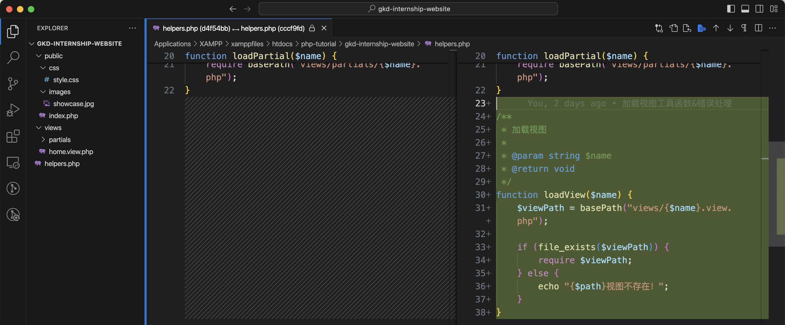

1. 在 **`public/index.php`** 中，通过调用 **`loadView('home1')`** 代替原来直接使用 **`require`** 加载 **`home.view.php`** 的方式。
2. 此时，因为 **`home1.view.php`** 不存在，它会输出一个错误消息（ **`"{$path}视图不存在！"`** ）。

<aside>
💡 这里有一个小错误，在错误消息中使用了 **`{$path}`** 变量，但应该是 **`{$viewPath}`** 才对。

</aside>

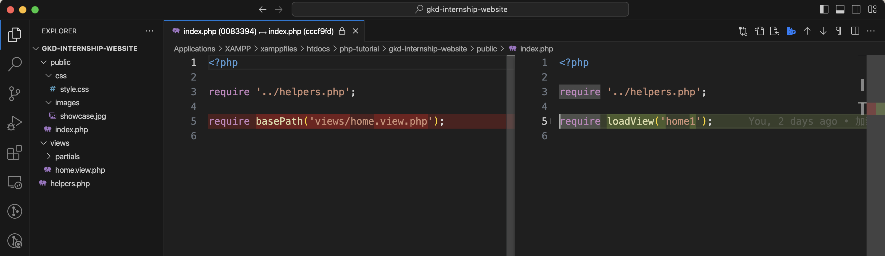

此时网页：

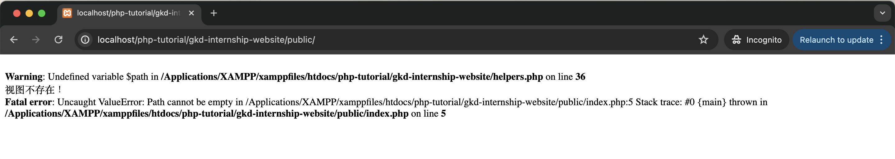

### **9. 更新`loadPartial`函数**

1. 在 **`loadPartial`** 函数中，您增加了对指定部分视图文件存在性的检查。如果文件存在，则正常加载；如果不存在，则输出错误信息，告知开发者指定的部分视图文件未找到。
2. **实现逻辑**：
    - 首先，构建部分视图文件的完整路径，使用 **`basePath`** 函数和拼接传入的部分视图名称。
    - 使用 **`file_exists`** 函数检查该路径下的文件是否存在。
    - 如果文件存在，则使用 **`require`** 语句加载该文件。
    - 如果文件不存在，则输出一个包含部分视图名称的错误消息。
    
    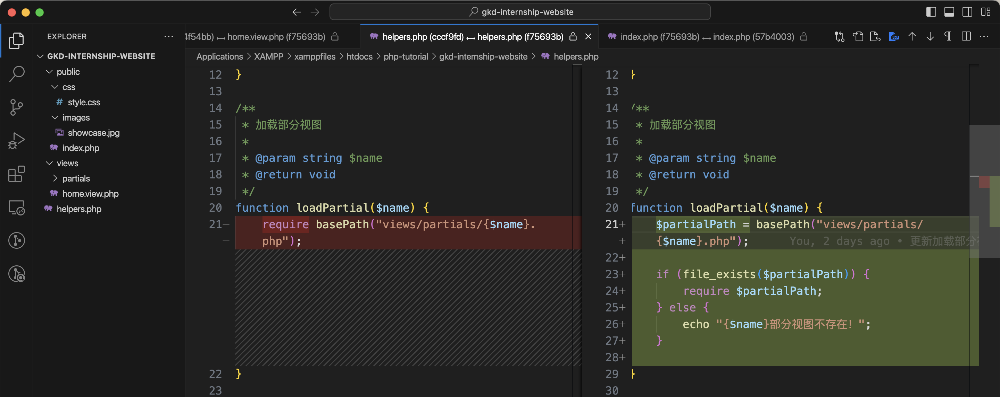
    
3. **修正视图加载调用**：将 **`public/index.php`** 中错误的视图加载调用（ **`loadView('home1')`** ）更正为正确的视图名称（ **`loadView('home')`** ），以确保可以正常加载主页视图。
    
    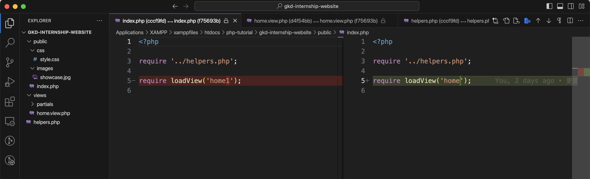
    

4. **错误处理测试**：在 **`home.view.php`** 中，通过将 **`loadPartial('head')`** 调用更改为 **`loadPartial('head1')`** ，这里创造一个故意的错误场景，用以测试 **`loadPartial`** 函数的错误处理逻辑。

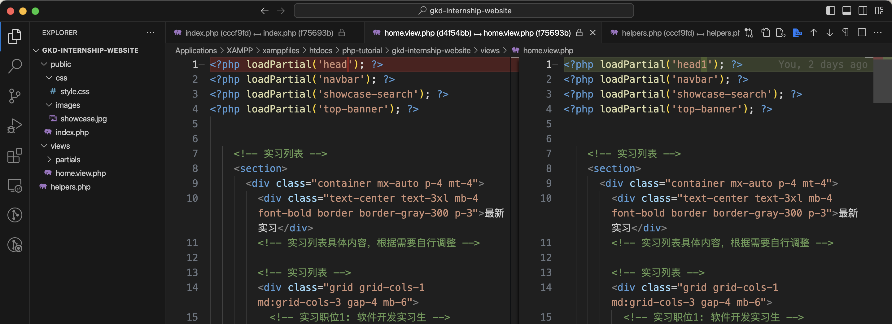

此时网页显示如下：

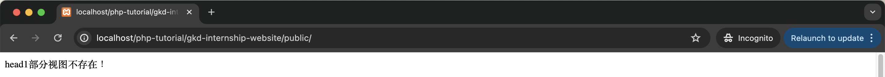

### **10. 新增`inspect`函数**

1. **功能说明**： **`inspect`** 函数的目的是提供一种简单的方法来输出变量的详细信息，包括类型和值，这对于开发过程中的调试非常有用。
2. **实现方法**：
    - 函数接受一个参数 **`$value`** ，这是需要检查的变量。
    - 使用 **`echo '<pre>';`** 输出前缀，目的是为了使输出的变量信息格式化，提高可读性。
    - 调用 **`var_dump($value);`** 输出变量的信息，包括类型和值。
    - 使用 **`echo '<pre>';`** 输出后缀，闭合前面的 **`<pre>`** 标签。
    
    
    
3. **修正头部文件名**：将 **`home.view.php`** 文件中的 **`head1`** 更正为 **`head`** ，这样可以确保头部部分能够被正确地加载和显示。
    
    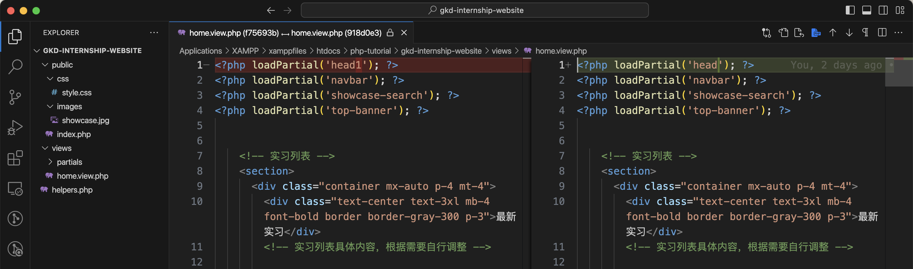
    
    此时网页显示正常：
    
    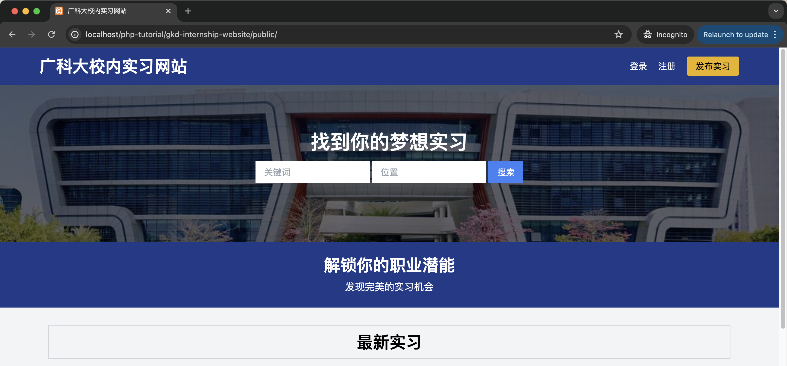
    

### **11. 新增`inspectAndDie`函数**

1. **功能说明**： **`inspectAndDie`** 函数的目的是在输出一个或多个变量的详细信息后，立即终止PHP脚本的执行。这在调试时非常有用，尤其是当需要验证代码某一点上的变量状态，并确保没有后续的代码执行影响调试结果时。
2. **实现逻辑**：
    - 使用 **`echo '<pre>';`** 开始，为了格式化输出，增加可读性。
    - 使用 **`die(var_dump($value));`** 组合命令来输出变量的详细信息，并立即终止脚本执行。 **`die()`** 函数在输出后停止了脚本， **`var_dump()`** 则是用来输出变量的详细信息。
    - 尽管在 **`die()`** 之后的 **`echo '<pre>';`** 是多余的，因为在 **`die()`** 函数执行后脚本就已经终止，后续的代码不会被执行。
    
    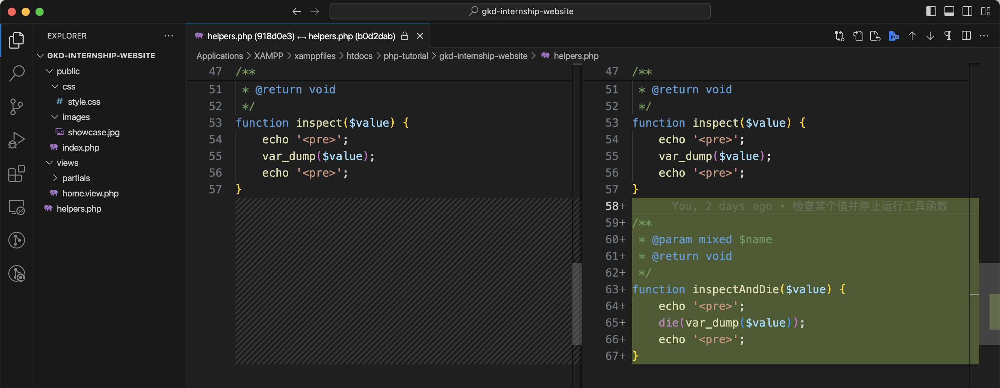
    

### **12. 在`loadView`函数使用调试函数**

1. 在 **`loadView`** 函数的实现中，通过在检查文件存在性之前调用 **`inspect`** 函数两次，目的是在尝试加载视图文件之前提供一个调试机制，使得开发者可以验证函数是否接收到了正确的视图名称参数，并且确认 **`basePath`** 函数是否正确构建了预期的文件路径。
    
    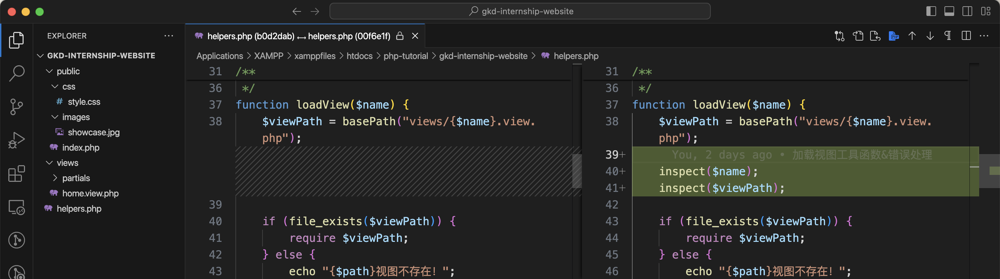
    
    此时网页效果：
    
    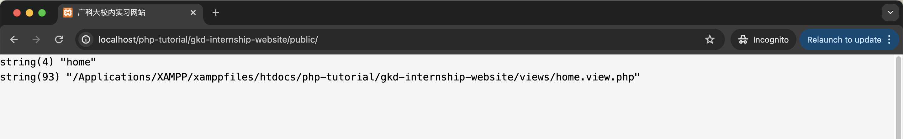
    
2. 在 **`loadView`** 函数中将 **`inspect`** 函数调用更换为 **`inspectAndDie`** ，这表示在输出视图名称（ **`$name`** 变量）后，脚本会立即停止执行。
    
    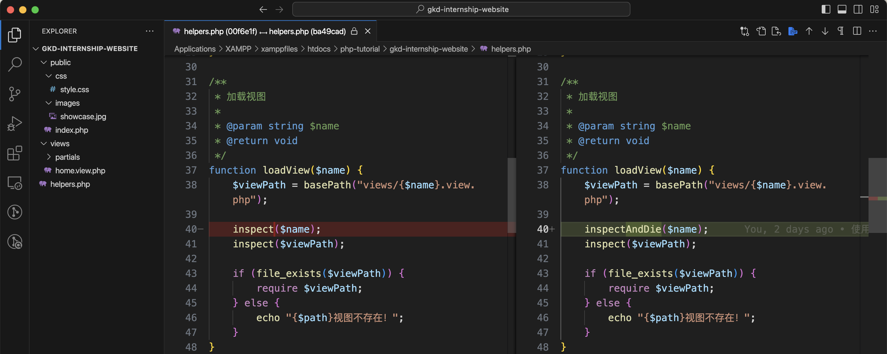
    
    此时网页效果：
    
    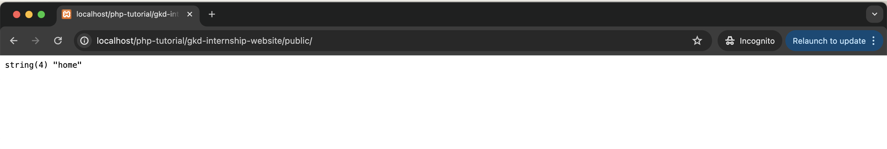
    
3. 测试完毕后，即可将调试函数删掉：
    
    
    

### **13. 修复调用`loadView`函数的方式**

1. **错误的调用方式**：原先的代码 **`require loadView('home');`** 错误地尝试将 **`loadView`** 函数的返回结果作为 **`require`** 语句的参数，这不是必要的，因为 **`loadView`** 函数内部已经负责加载视图文件。
2. **正确的调用方式**：修正后的代码直接调用 **`loadView('home');`** ，这是正确的用法。 **`loadView`** 函数设计为直接加载指定的视图文件，如果该文件存在，则执行文件中的PHP代码。
    
    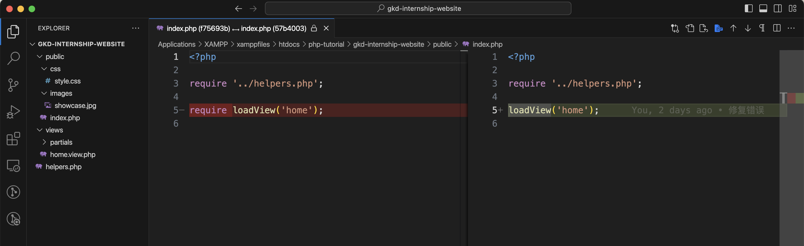
    

### **14. 修改 Apache 配置文件以改变服务器跟路径对应的目录**

**Windows的操作**

在 XAMPP 中，当你访问  **`localhost`**  时，默认是导向  **`/htdocs`**  目录。如果你想修改这个默认行为，让它导向本项目所在路径，比如（  **`/htdocs/php-tutorial/gkd-internship-website/public`**  ），你需要更改 Apache 的配置文件。

1. **打开 Apache 配置文件**：
找到 XAMPP 控制面板，点击 Apache 模块旁的 "Config" 按钮，然后选择 "Apache (httpd.conf)"。这将打开 Apache 的主配置文件  **`httpd.conf`** 。
2. **修改 DocumentRoot 和 Directory**：
在  **`httpd.conf`**  文件中，找到  **`DocumentRoot`**  和  **`<Directory>`**  相关的行。默认情况下，它们可能看起来像这样：
    
    ```
    DocumentRoot "C:/xampp/htdocs"
    <Directory "C:/xampp/htdocs">
    ```
    
    将它们更改为你的目标目录路径，例如：
    
    ```
    DocumentRoot "C:/xampp/htdocs/php-tutorial/gkd-internship-website/public"
    <Directory "C:/xampp/htdocs/php-tutorial/gkd-internship-website/public">
    ```
    
3. **保存并重启 Apache**：
对  **`httpd.conf`**  文件所做的更改保存后，回到 XAMPP 控制面板，停止 Apache 模块，并重新启动它。这样，更改就会生效。

**Mac或者Linux的操作**

1. **打开终端**
2. **编辑 Apache 配置文件**：
macOS 上的 Apache 配置文件通常位于  **`/etc/apache2/httpd.conf`** 。你需要使用管理员权限来编辑这个文件。可以使用任意文本编辑器，这里以 vim 编辑器为例：
    
    ```bash
    sudo vi /etc/apache2/httpd.conf
    ```
    
    输入你的管理员密码后，将会打开配置文件。
    
3. **修改 DocumentRoot 和 Directory**：
在  **`httpd.conf`**  文件中，找到  **`DocumentRoot`**  和  **`<Directory>`**  相关的行。比如：
    
    ```
    DocumentRoot "/Applications/XAMPP/xamppfiles/htdocs"
    <Directory "/Applications/XAMPP/xamppfiles/htdocs">
    ```
    
    将它们更改为你的目标目录路径，例如：
    
    ```
    DocumentRoot "/Applications/XAMPP/xamppfiles/htdocs/php-tutorial/gkd-internship-website/public"
    <Directory "/Applications/XAMPP/xamppfiles/htdocs/php-tutorial/gkd-internship-website/public">
    ```
    
    确保将  **`yourusername`**  替换为你的 macOS 用户名，且路径正确匹配你的项目结构。
    
4. **保存并退出**：
默认模式下，按  **`!wq`**  保存更改并退出编辑器。
5. **重新启动 Apache**：
为了让更改生效，需要重新启动 Apache。

**创建`.htaccess`文件进行URL重写**

1. **启用重写引擎**：通过 **`RewriteEngine On`** 指令启用Apache的重写引擎，这是使用mod_rewrite模块进行URL重写的前提。
2. **定义重写条件**：通过两个 **`RewriteCond`** 指令设置条件，以便仅当请求的不是实际存在的文件( **`!-f`** )和目录( **`!-d`** )时，才进行URL重写。
3. **定义重写规则**： **`RewriteRule ^ index.php [L]`** 指令将所有满足上述条件的请求重写到 **`public/index.php`** 文件。这里的 **`^`** 表示匹配所有请求， **`[L]`** 标志表示这是最后一条规则，在匹配之后不再继续处理其他规则。
    
    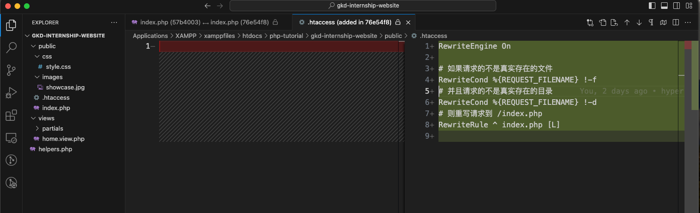
    

**设置`public/index.php`作为统一入口**

1. **定义路由数组**：在 **`index.php`** 中定义了一个名为 **`$routes`** 的数组，该数组映射了URL路径到对应的处理文件。这为实现一个简单的路由机制提供了基础。
2. **捕获当前请求URI**：通过 **`$_SERVER['REQUEST_URI']`** 获取当前请求的URI，这一信息将用于判断请求应当如何被处理。
3. **调试当前URI**：使用 **`inspectAndDie($uri);`** 输出当前请求的URI，并终止脚本执行。这是为了测试路由设置是否正常工作，确保所有请求都正确地通过 **`.htaccess`** 文件重写到了 **`index.php`** 。
    
    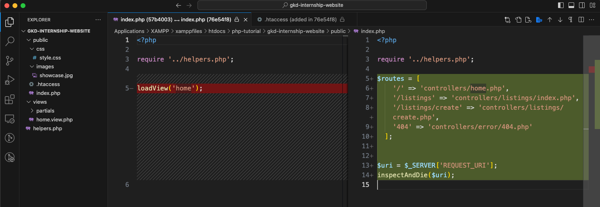
    
4. 此时的网页应该能获得当前访问的URI：
    
    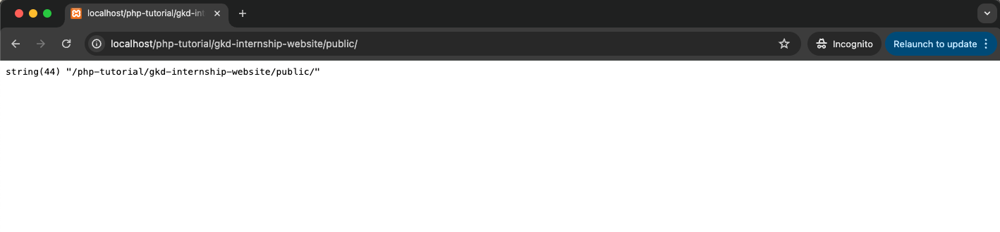
    

### **15. 实现初步路由逻辑**

1. **路由匹配与加载控制器**：
    - 使用 **`array_key_exists($uri, $routes)`** 检查当前请求的URI是否存在于路由数组 **`$routes`** 中。
    - 如果存在，则使用 **`require(basePath($routes[$uri]));`** 加载与当前URI匹配的控制器文件。这里， **`basePath`** 函数用于获取控制器文件的完整路径。
    - 如果不存在，即没有为当前请求的URI定义路由规则，则加载404错误处理控制器，通过 **`require(basePath($routes['404']));`** 实现。
    
    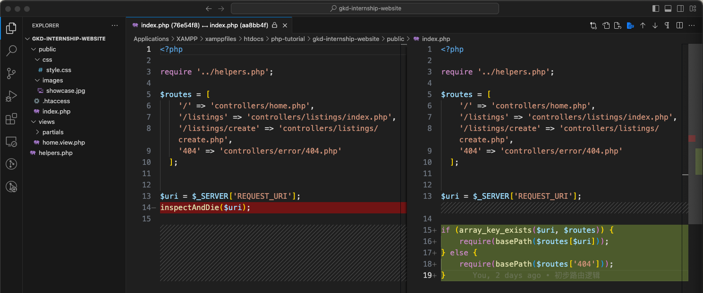
    

### **16. 创建主页控制器**

1. **新建`home.php`控制器文件**：在 **`controllers`** 目录下创建一个新文件 **`home.php`** 。该文件将作为主页请求的处理器。
2. **编写控制器逻辑**：
    - 控制器文件的内容非常简单，仅包含了对 **`loadView`** 函数的调用。
    -  **`loadView('home');`** 表示加载位于 **`views`** 目录下名为 **`home.view.php`** 的视图文件，这个文件包含了主页的HTML结构和内容。
3. 通过在路由数组 **`$routes`** 中定义与 **`/`** （主页路径）对应的控制器为 **`controllers/home.php`** ，并在 **`home.php`** 控制器中加载主页视图，您成功实现了主页路由的完整流程。当用户访问网站的根URL时，请求被路由到 **`home.php`** 控制器，控制器随即加载并呈现主页视图。
    
    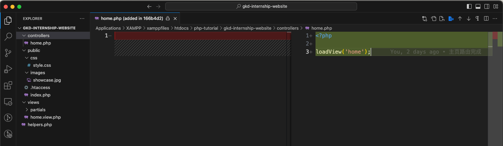
    
    此时访问主页（注意看地址栏中的路径已经改变，因为之前已经修改 Apache 服务器的根路径已经指向了我们项目的 **`public`** 文件夹）：
    
    
    

### **17. 创建工作列表控制器**

1. **新建`index.php`控制器文件**：在 **`controllers/listings`** 目录下创建了一个新的 **`index.php`** 文件。这个文件将作为处理工作列表页面请求的控制器。
2. **控制器内容**：在该文件中，目前只有一行PHP代码 **`echo '工作列表';`** 。这是一个非常简单的实现，目的是在访问工作列表页面时显示文本消息“工作列表”。
    
    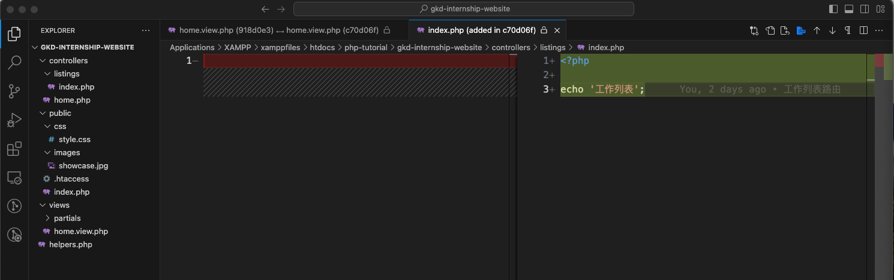
    
3. **修改链接指向**：在 **`home.view.php`** 视图文件中，您将查看所有实习的链接由指向 **`listings.html`** 更改为指向 **`/listings`** 。这个更改意味着当用户点击这个链接时，请求将通过您设置的路由逻辑来处理，而不是直接请求一个静态HTML文件。
    
    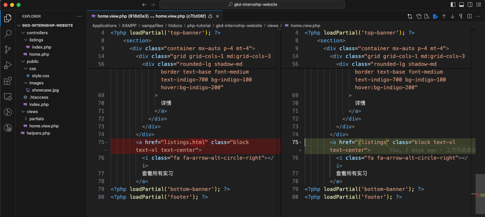
    
4. 在路由数组 **`$routes`** 中， **`/listings`** 的路径应该被映射到 **`controllers/listings/index.php`** ，这样当请求 **`/listings`** 时，就会加载并执行该控制器文件。
    
    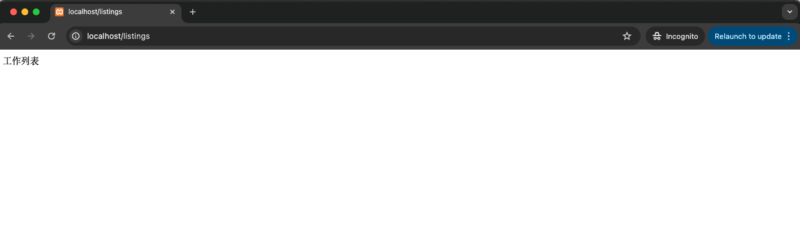
    

### **18. 创建发布实习控制器**

1. **新建`create.php`控制器文件**：在 **`controllers/listings`** 目录下创建一个新文件 **`create.php`** 。这个文件将作为处理发布实习页面请求的控制器。
2. **控制器内容**：目前，控制器文件中只有一行PHP代码 **`echo '发布实习';`** 。这是一个简单的实现，目的是在访问发布实习页面时显示文本消息“发布实习”。
    
    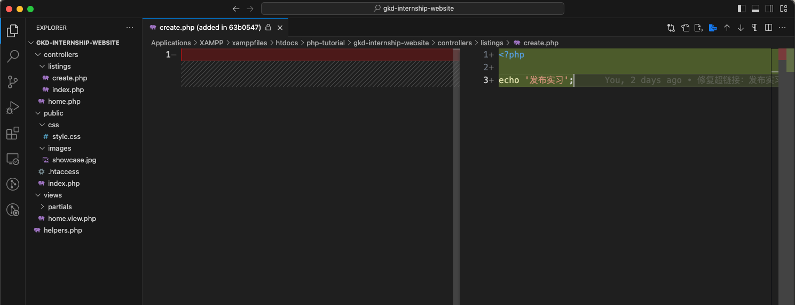
    
3. **更新底部横幅链接**：在 **`views/partials/bottom-banner.php`** 文件中，将发布实习的链接从指向静态HTML文件 **`post-job.html`** 更改为指向新的动态路由 **`/listings/create`** 。
    
    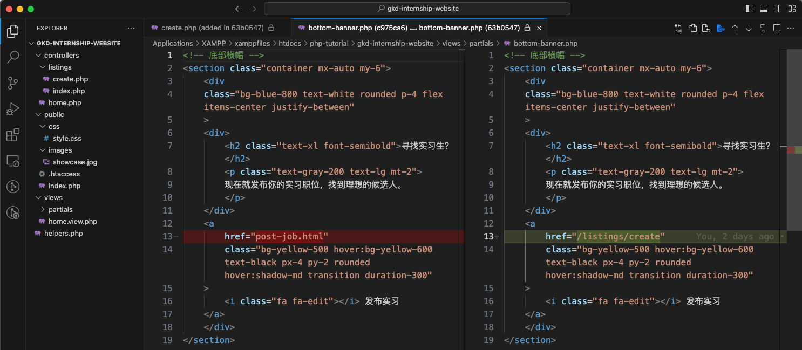
    
4. **更新导航栏链接**：在 **`views/partials/navbar.php`** 文件中，同样将发布实习的链接更新为 **`/listings/create`** 。
    
    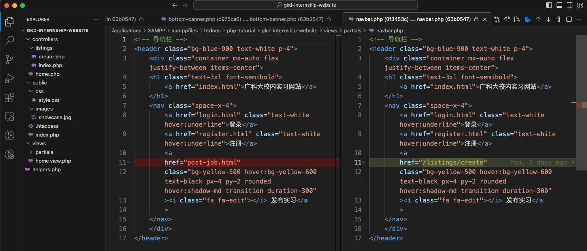
    
5. 在之前定义的路由数组 **`$routes`** 中， **`/listings/create`** 的路径应当映射到 **`controllers/listings/create.php`** ，这样当请求 **`/listings/create`** 时，会加载并执行该控制器文件。
    
    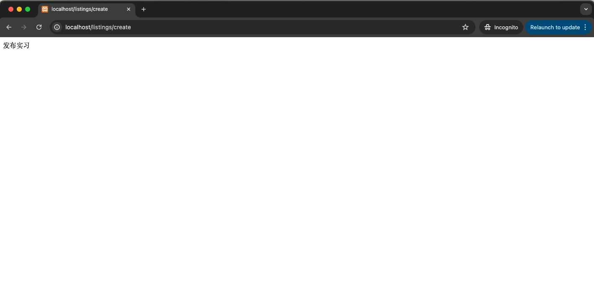
    

### **19. 创建404错误处理控制器**

1. **新建`404.php`控制器文件**：在 **`controllers/error`** 目录下创建一个新的文件 **`404.php`** 。
2. **控制器内容**：在 **`404.php`** 文件中，目前只有一个简单的PHP语句 **`echo '404';`** 。这代表当触发404错误时，用户将看到一个简单的文本消息"404"，表明他们请求的页面或资源不存在。
3. 这表示当用户访问一个不存在的页面或资源时，系统会显示一个简单的404错误消息。
    
    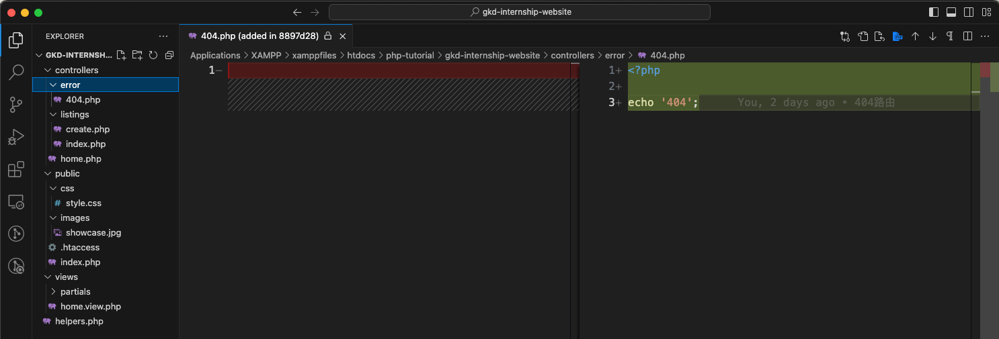
    
    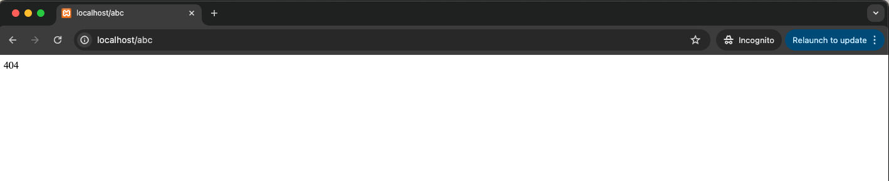
    

### **20. 实现工作列表页面的视图展示**

1. **更新`index.php`控制器**：在 **`controllers/listings/index.php`** 文件中，将原先直接输出"工作列表"的 **`echo`** 语句替换为 **`loadView('listings/index');`** 。这个更改意味着当访问工作列表页面时，将加载并渲染指定的视图文件。
    
    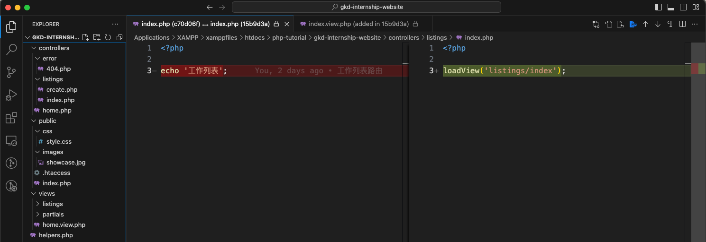
    
2.  **新建`index.view.php`视图文件**：在 **`views/listings`** 目录下创建了一个新的视图文件 **`index.view.php`** 。这个文件是工作列表页面的视图模板，目前只包含简单的文本"Hello"。
    
    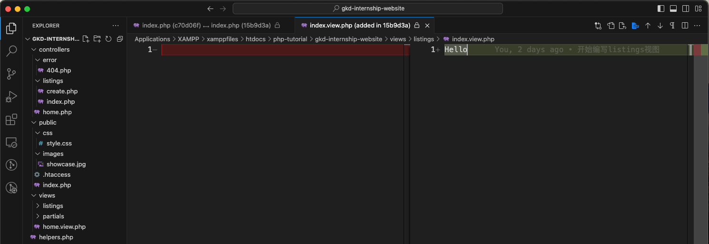
    
3. 修改 **`index.view.php`** 文件的内容，将其从简单的文本消息转换为一个完整的实习列表页面视图。
    
    ```bash
    <?php loadPartial('head'); ?>
    <?php loadPartial('navbar'); ?>
    <?php loadPartial('top-banner'); ?>
    
        
    <!-- 实习列表 -->
    <section>
        <div class="container mx-auto p-4 mt-4">
        <div class="text-center text-3xl mb-4 font-bold border border-gray-300 p-3">所有实习</div>
        <div class="grid grid-cols-1 md:grid-cols-3 gap-4 mb-6">
            <!-- 示例实习职位 -->
            <!-- 实习职位1: 软件工程师 -->
            <div class="rounded-lg shadow-md bg-white">
            <div class="p-4">
                <h2 class="text-xl font-semibold">软件工程师</h2>
                <p class="text-gray-700 text-lg mt-2">
                我们正在寻找一位熟练的软件工程师来开发高质量的软件解决方案。
                </p>
                <ul class="my-4 bg-gray-100 p-4 rounded">
                <li class="mb-2"><strong>薪资:</strong> ¥80,000</li>
                <li class="mb-2">
                    <strong>地点:</strong> 广州
                    <span
                    class="text-xs bg-blue-500 text-white rounded-full px-2 py-1 ml-2"
                    >校内</span
                    >
                </li>
                <li class="mb-2">
                    <strong>标签:</strong> <span>开发</span>, <span>编程</span>
                </li>
                </ul>
                <a href="details.html"
                class="block w-full text-center px-5 py-2.5 shadow-sm rounded border text-base font-medium text-indigo-700 bg-indigo-100 hover:bg-indigo-200"
                >
                详情
                </a>
            </div>
            </div>
            <!-- 更多实习职位可以根据需要添加 -->
        </div>
        </div>
    </section>
    
    <?php loadPartial('bottom-banner'); ?>
    <?php loadPartial('footer'); ?>
    ```
    
    此时网页：
    
    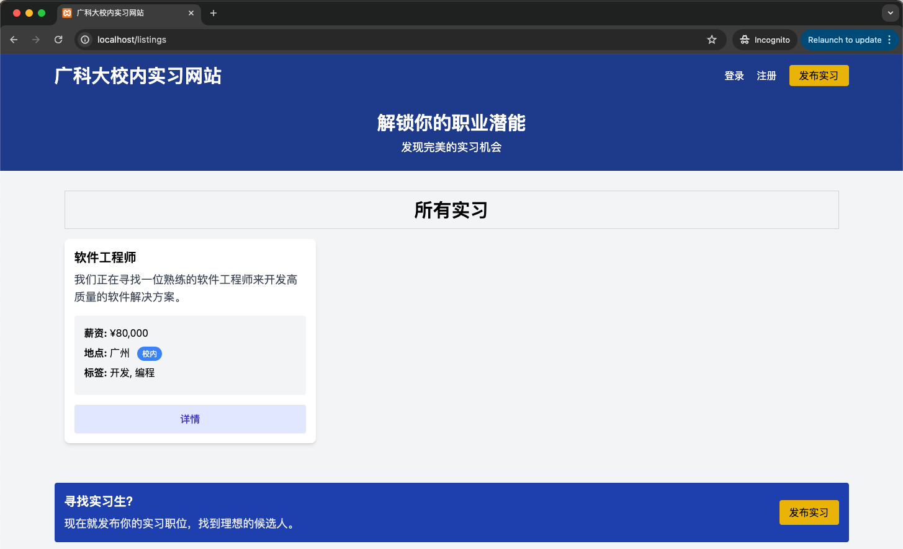
    

### **21. 发表实习视图的实现**

1. **加载新视图**：修改 **`create.php`** 控制器，让它通过 **`loadView`** 函数加载新的视图文件 **`listings/create`** ，以代替之前的简单文本输出。这标志着发布实习页面将展示一个具体的表单视图给用户。
    
    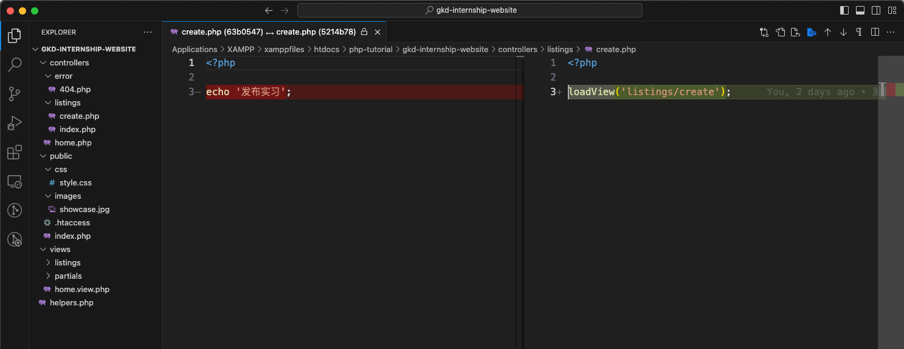
    
2.  在 **`views/listings`** 目录下创建了 **`create.view.php`** ，该文件包含了一个详细的发布实习表单，涵盖了职位信息、公司信息和地点等多个字段，以及保存和取消的操作按钮。
    
    ```bash
    <?php loadPartial('head'); ?>
    <?php loadPartial('navbar'); ?>
    <?php loadPartial('top-banner'); ?>
    
    <!-- 发布工作表单 -->
    <section class="flex justify-center items-center mt-20">
        <div class="bg-white p-8 rounded-lg shadow-md w-full md:w-600 mx-6">
        <h2 class="text-4xl text-center font-bold mb-4">创建工作列表</h2>
        <form method="POST">
            <h2 class="text-2xl font-bold mb-6 text-center text-gray-500">
            职位信息
            </h2>
            <div class="mb-4">
            <input
                type="text"
                name="title"
                placeholder="职位标题"
                class="w-full px-4 py-2 border rounded focus:outline-none"
            />
            </div>
            <div class="mb-4">
            <textarea
                name="description"
                placeholder="职位描述"
                class="w-full px-4 py-2 border rounded focus:outline-none"
            ></textarea>
            </div>
            <div class="mb-4">
            <input
                type="text"
                name="salary"
                placeholder="年薪"
                class="w-full px-4 py-2 border rounded focus:outline-none"
            />
            </div>
            <div class="mb-4">
            <input
                type="text"
                name="requirements"
                placeholder="要求"
                class="w-full px-4 py-2 border rounded focus:outline-none"
            />
            </div>
            <div class="mb-4">
            <input
                type="text"
                name="benefits"
                placeholder="福利"
                class="w-full px-4 py-2 border rounded focus:outline-none"
            />
            </div>
            <h2 class="text-2xl font-bold mb-6 text-center text-gray-500">
            公司信息 & 地点
            </h2>
            <div class="mb-4">
            <input
                type="text"
                name="company"
                placeholder="公司名称"
                class="w-full px-4 py-2 border rounded focus:outline-none"
            />
            </div>
            <div class="mb-4">
            <input
                type="text"
                name="address"
                placeholder="地址"
                class="w-full px-4 py-2 border rounded focus:outline-none"
            />
            </div>
            <div class="mb-4">
            <input
                type="text"
                name="city"
                placeholder="城市"
                class="w-full px-4 py-2 border rounded focus:outline-none"
            />
            </div>
            <div class="mb-4">
            <input
                type="text"
                name="state"
                placeholder="省份"
                class="w-full px-4 py-2 border rounded focus:outline-none"
            />
            </div>
            <div class="mb-4">
            <input
                type="text"
                name="phone"
                placeholder="电话"
                class="w-full px-4 py-2 border rounded focus:outline-none"
            />
            </div>
            <div class="mb-4">
            <input
                type="email"
                name="email"
                placeholder="接收申请的电子邮箱地址"
                class="w-full px-4 py-2 border rounded focus:outline-none"
            />
            </div>
            <button
            class="w-full bg-green-500 hover:bg-green-600 text-white px-4 py-2 my-3 rounded focus:outline-none"
            >
            保存
            </button>
            <a
            href="/"
            class="block text-center w-full bg-red-500 hover:bg-red-600 text-white px-4 py-2 rounded focus:outline-none"
            >
            取消
            </a>
        </form>
        </div>
    </section>
    
    <?php loadPartial('bottom-banner'); ?>
    <?php loadPartial('footer'); ?>
    ```
    
3. 在 **`head.php`** 中，将CSS样式表的路径从相对路径更新为根路径引用 **`/css/style.css`** 。这确保了无论当前页面的URL路径是什么，样式表都能被正确地找到并应用。此时网页：
    
    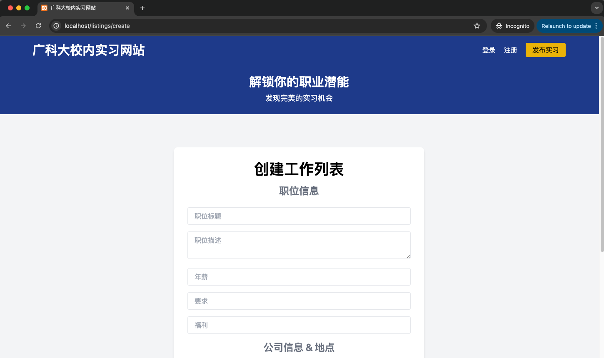
    

### **22. 404视图**

1.  **加载404视图**：在 **`controllers/error/404.php`** 文件中，将之前直接输出的"404"文本消息替换为了 **`loadView('error/404');`** ，意味着当发生404错误时，将加载并展示 **`error/404.view.php`** 视图文件。
    
    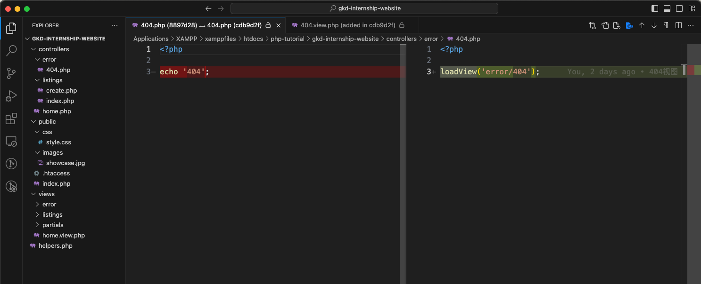
    
2. **构建视图文件**：在 **`views/error`** 目录下新建了一个文件 **`404.view.php`** ，其中定义了404错误页面的HTML结构和内容。
    
    
    
3. 此时当用户输入不存在路径的时候，将导向网站错误处理页面：

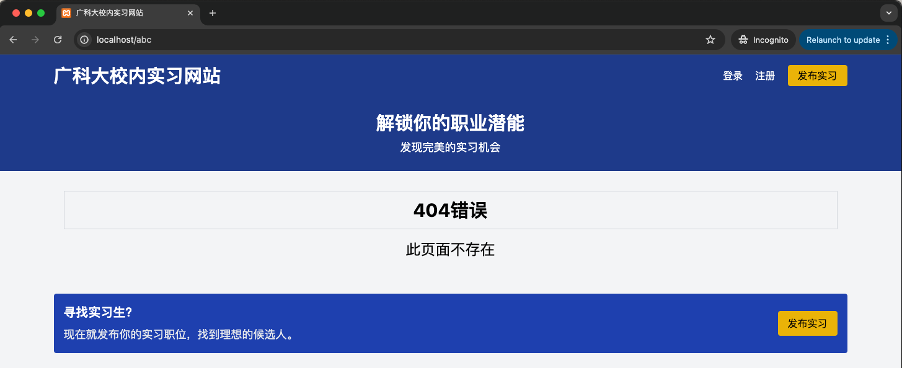

### **22. 重构路由规则**

1. 将原有的路由数组和路由匹配逻辑从 **`public/index.php`** 中移除，取而代之的是一个引入 **`router.php`** 文件的调用。目的将路由逻辑转移到了独立的文件中，提高了代码的模块化和可维护性。
    
    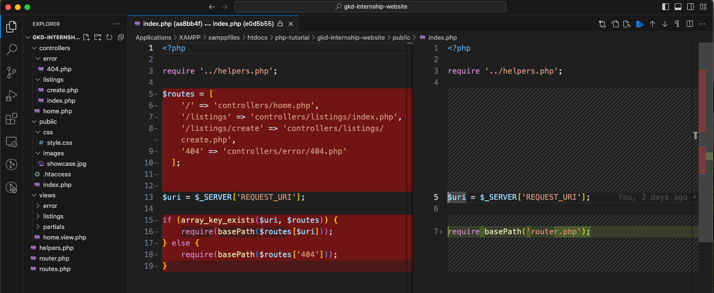
    
2. **创建`router.php`处理路由逻辑**
    - 在根目录下创建了 **`router.php`** 文件，该文件现在负责读取路由定义并根据当前请求的URI来加载相应的控制器。
    -  **`router.php`** 首先引入 **`routes.php`** 文件，后者返回一个包含所有路由定义的数组。
    - 然后，将原先在 **`index.php`** 中的路由处理逻辑转移至此。
    
    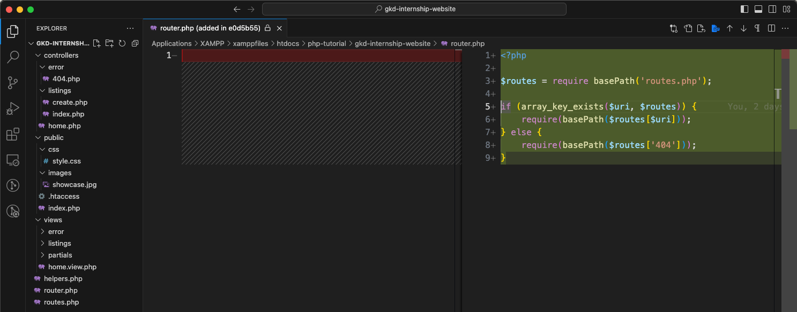
    
3. **创建`routes.php`定义路由**
    - 在根目录下创建了 **`routes.php`** 文件，将原来 **`index.php`** 中的路由数组转移至此。
        
        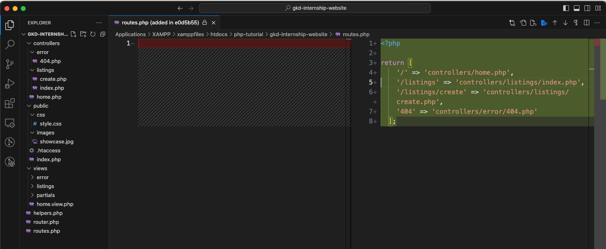
        
4. **更新`views/partials/navbar.php`** 
    - 在 **`navbar.php`** 部分视图中，将指向主页的链接更新为 **`/`** ，确保无论在应用的哪个部分点击该链接都能正确返回主页。
        
        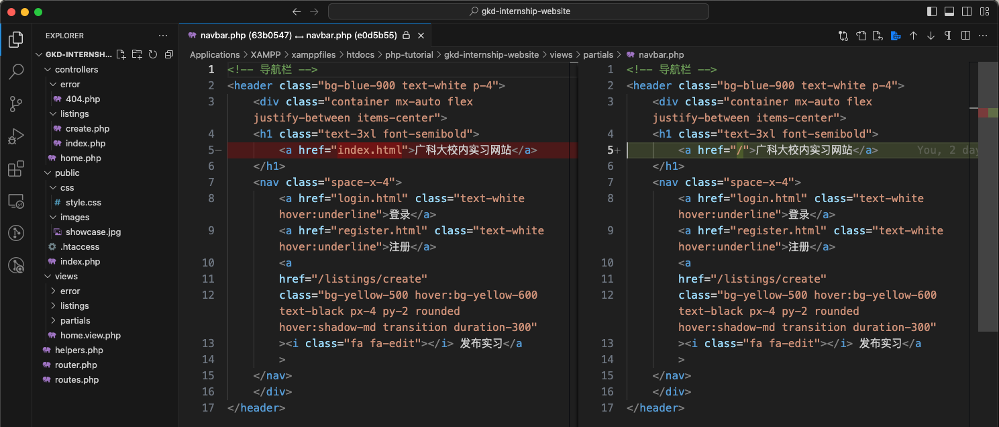
        
5. 确保当用户尝试访问不存在的页面时，服务器不仅返回404错误页面，同时也发送了正确的HTTP响应状态码404。
    
    
    
6. 此时刷新你的网站，各个路由应该能正常访问。
7. 直到现在，项目文件夹的文件结构如下，供同学们参考和验证：
    
    ```
    .
    ├── controllers
    │   ├── error
    │   │   └── 404.php
    │   ├── home.php
    │   └── listings
    │       ├── create.php
    │       └── index.php
    ├── helpers.php
    ├── public
    │   ├── css
    │   │   └── style.css
    │   ├── images
    │   │   └── showcase.jpg
    │   └── index.php
    ├── router.php
    ├── routes.php
    └── views
        ├── error
        │   └── 404.view.php
        ├── home.view.php
        ├── listings
        │   ├── create.view.php
        │   └── index.view.php
        └── partials
            ├── bottom-banner.php
            ├── footer.php
            ├── head.php
            ├── navbar.php
            ├── showcase-search.php
            └── top-banner.php
    
    11 directories, 20 files
    ```
    

## **实验任务要求**

### 目标

本实验的目的是让学生通过构建一个基于PHP的简易Web项目《广科大校内实习网站》来实践Web开发和版本控制的基本技能。在本实验中，学生将学习到Web服务器的配置、PHP编程、HTML/CSS前端设计，以及使用Git进行版本控制的技巧。

### 任务步骤

1. **环境准备**：确保你的开发环境包括了PHP环境、Apache服务器以及Git。推荐使用XAMPP作为开发和测试环境，因为它简单易用，包含了上述所有组件。
2. **项目初始化**：在你的本地开发环境中，创建一个新的项目文件夹，并初始化为Git仓库。
3. **逐步构建项目**：按照本指导书前述的步骤，从创建静态HTML页面开始，逐步引入PHP逻辑、配置Apache服务器以支持友好的URL路径，以及逐步将数据和逻辑分离，使用MVC模式进行组织代码。
4. **Git版本控制**：在开发过程中，务必使用Git进行版本控制。你需要完成至少10次有意义的提交，每次提交都应该对应一个明确的开发步骤或功能实现。每次提交前，请确保你的代码是可以正常工作的。
5. **代码托管和分享**：
    - 在[Gitee](https://gitee.com/)上注册账户（如果你还没有的话）。
    - 在Gitee上新建一个仓库，用于托管你的《广科大校内实习网站》项目。
    - 将你的本地Git仓库推送到Gitee上。
    - 确保将仓库设置为公开。
6. **提交项目链接**：在实验结束后，将你的Gitee项目仓库的链接（以.git结尾的链接）提交到学习通中。